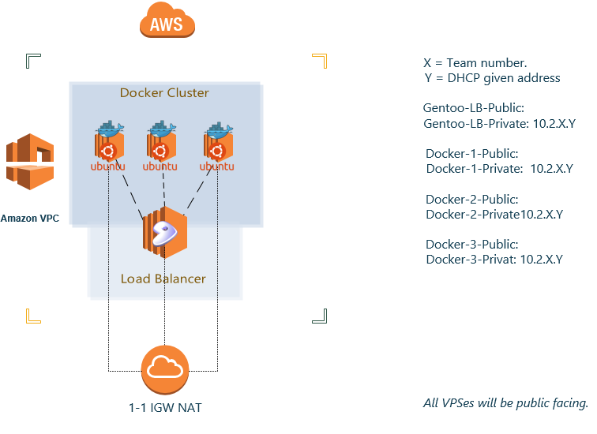

# Ansible Playbooks & Automation
#### AWS Production Topology



## FAQ For Docker Beginners

### How to export a Docker container into an image.
```
docker export 6c2209c66168 -o Docker_www_ccdc.tar.gz                                    
```

### How to import pre-build Docker image.
```
docker import Docker_www_ccdc.tar.gz
```

### How to mount directory into container.
```
docker run -v /absolute/path/:/internal/docker/directory/ container:tag /executable/
```

### How to build Docker a container.

```
docker build -t ccdc\www .
```

<br />

## Testing Playbooks
### Vagrant Playbook testing
* Change VagrantFile to be provisioned via Ansible.

```
config.vm.provision "ansible" do |ansible|
    ansible.verbose = "v"
    ansible.playbook = "YOUR_PLAYBOOK_HERE.yml"
end
```

### Ansible Playbooks

#### key-copy.yml
Purpose: copy public key to authorized key file of users on destination machine.
* Q) Why is every user given the same key-pair?
* A) This was meant as an exercise in handling key-revocaition.

#### bind-install.yml
Purpose: Install Bind DNS for core blackteam infrastructure and copy <br />
pre-made configs onto Ubuntu based Bind server.

#### docker-install.yml
Purpose: Install Docker via Docker's bootstrap script.
* Q) Why not use repos?
* A) Old versions of Docker do not support some features used in NECCDC.

#### nginx-loadbalancer.yml
Purpose: Install Nginx on Gentoo.
* Q) Why did you just use "shell" commands via Ansible?
* A) Ansible's portage at this time of writing is was not sufficient.

#### ubuntu-misconfiguration.yml
Purpose: Boot strap ubuntu with various configurations that can have security consequences.

### Jenkin & Gitlab Deployment
1) Run jenkins-and-gitlab.yml
2) Go to IP:8080
3) Complete Jenkins-Post install through web

#### Jenkins Plugins to enable
* Gitlab Plugin
* SSH Plugin
* Publish over SSH
* Leave the rest to defaults
* Credentials: admin/Netsys123$:w
* Email adminteam0@fsports.co

#### Gitlab
1) Run the command below after making appropriate changes.
```
sudo gitlab-ctl reconfigure
